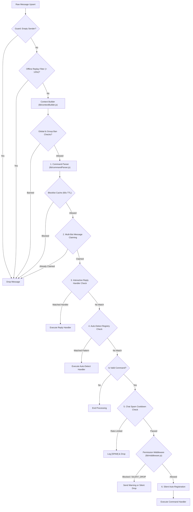

# System Architecture & Pipeline

WA-Bot-Engine provides a lightweight, modular foundation for multi-instance WhatsApp bots. This document details the runtime architecture, message processing pipeline, multi-bot concurrency model, hot-reloading mechanism, and identity resolution architecture.

---

## 1. Message Processing Pipeline

Every incoming message received through Baileys' `messages.upsert` event passes through a sequential, 12-stage pipeline defined in [`handler.js`](../handler.js):



### Pipeline Stages Breakdown

1. **Guard**: Drops malformed messages without a valid sender JID.
2. **Offline Replay Filter**: Compares `messageTimestamp` to current time. Messages older than 120 seconds (e.g. queued while bot was disconnected) are discarded to prevent double execution.
3. **Context Builder**: Resolves sender JID (strips multi-device IDs, converts LID to canonical PN), fetches or reads cached group metadata, determines group admin roles, owner permissions, and bot admin status.
4. **Early Ban Checks**: Silently drops messages if the group is banned, the user is globally banned, or the user is banned in this specific group.
5. **Command Parsing**: Identifies configured prefixes (default: `!`, `.`, `#`, `/`, `-`) and extracts `commandName`, `args`, and `rawArgs`.
6. **Blocklist Check**: Compares sender against the bot's WhatsApp blocklist using a 60-second TTL cache to prevent network overhead.
7. **Multi-Bot Claiming**: In multi-bot groups, bots coordinate via SQLite table `message_claims`. The bot with the highest priority claims the message; others drop it silently. Commands flagged with `multiBot: true` bypass this check.
8. **Reply Handlers**: If the incoming message is a quoted reply to an interactive bot message, routes directly to the registered interactive handler.
9. **Auto-Detect Patterns**: Evaluates registered regex patterns (via `registerAutoDetect`). If a match occurs, invokes the registered handler and stops pipeline progression.
10. **Chat Spam Cooldown**: Enforces per-chat cooldowns (default: 5000ms) to protect the bot from rate limits and flooding.
11. **Permission Middleware**: Validates declarative command flags (`groupOnly`, `adminOnly`, `botAdminRequired`, `ownerOnly`, `privateOnly`, `silentDrop`).
12. **Auto-Registration & Execution**: Automatically records the user in SQLite on first command execution, logs the run via `logger.exec`, and calls `command.handler()`.

---

## 2. Multi-Instance Concurrency Model

WA-Bot-Engine supports running multiple bot instances on a single machine or server using PM2 and SQLite WAL mode.

```
┌─────────────────────────────────────────────────────────────┐
│                       Host System                           │
│                                                             │
│   ┌──────────────────┐   ┌──────────────────┐               │
│   │   Bot Instance 1 │   │   Bot Instance 2 │   ...         │
│   │   BOT_ID: bot1   │   │   BOT_ID: bot2   │               │
│   │   sessions/bot1/ │   │   sessions/bot2/ │               │
│   │   temp/bot1/     │   │   temp/bot2/     │               │
│   └─────────┬────────┘   └─────────┬────────┘               │
│             │                      │                        │
│             └──────────┬───────────┘                        │
│                        ▼                                    │
│             ┌──────────────────────┐                        │
│             │   SQLite (WAL Mode)  │                        │
│             │   - message_claims   │                        │
│             │   - bot_registry     │                        │
│             │   - users, groups    │                        │
│             └──────────────────────┘                        │
└─────────────────────────────────────────────────────────────┘
```

### Shared vs. Isolated Resources

| Resource | Scope | Description |
| :--- | :--- | :--- |
| **Auth Credentials** | **Isolated** | Stored under `sessions/<botId>/`. Each bot has an independent session. |
| **Temporary Files** | **Isolated** | Saved to `temp/<botId>/`. Cleanup jobs purge only the instance's directory. |
| **Memory State** | **Isolated** | Sockets, blocklist caches, and reply handler maps reside in process memory. |
| **SQLite Database** | **Shared** | `database.db` accessed via WAL mode (safe concurrent writes). |
| **Message Claims** | **Shared** | `message_claims` table guarantees exactly one bot executes a command. |
| **Heartbeat Registry**| **Shared** | `bot_registry` tracks active bot JIDs and priority order every 60s. |

### Message Deduplication Mechanics

When multiple bots share a group:
1. Each bot attempts an atomic SQLite insert into `message_claims`:
   ```sql
   INSERT INTO message_claims (stanza_id, bot_id, created_at) VALUES (?, ?, ?);
   ```
2. Due to the `PRIMARY KEY (stanza_id)`, only the first transaction succeeds.
3. If the insert fails with a unique constraint error, the bot drops the message silently.

---

## 3. Hot-Reloading Architecture

WA-Bot-Engine supports instant reloading for both command modules and the core message pipeline without terminating the process or disconnecting from WhatsApp:

- **Command Hot-Reloading**: [`chokidar`](https://github.com/paulmillr/chokidar) watches `commands/`. When a file is created or edited:
  - Cache-busting dynamic import: `import(`${filePath}?cacheBust=${Date.now()}`)`.
  - The module is registered into `commands/_registry.js`. Existing commands update in-place.
- **Handler Hot-Reloading**: Chokidar watches `handler.js`. When modified:
  - The handler module is re-imported dynamically.
  - `msgHandler` reference in `index.js` is swapped atomically.
  - A reload counter warns when ESM module cache accumulations suggest a process restart to free memory.

---

## 4. WhatsApp Identity Resolution (LID vs. PN)

WhatsApp accounts are identified by two addressing formats:
- **PN (Phone Number JID)**: `<number>@s.whatsapp.net` (standard direct messaging format).
- **LID (Linked Device ID)**: `<numeric_id>@lid` (privacy-preserving identifier used in newer group modes).
- **Multi-Device Suffix**: `<number>:<device>@s.whatsapp.net` (e.g. `628123:4@s.whatsapp.net`).

### The Canonical ID Rule

> **Rule**: Never use raw, un-normalized JIDs as database keys or for permission comparisons.

1. **Stripping Device IDs**:  
   `jidNormalizedUser(rawJid)` strips `:device` suffixes.
2. **Converting LID to PN**:  
   `resolveUserId(jid)` looks up the mapping in the SQLite `identity_map` table (populated passively during message exchanges).
3. **Canonical Normalization Helper**:  
   [`toCanonicalUserId(jid)`](../lib/database.js) combines both steps:
   ```javascript
   export function toCanonicalUserId(jid) {
       if (!jid) return jid;
       return resolveUserId(jidNormalizedUser(jid));
   }
   ```
4. **Target Extraction**:  
   Commands use [`extractTarget(message, args)`](../lib/jidHelper.js) to resolve mentions, quoted messages, or typed phone numbers into canonical PN form.
5. **Group API JID Lookup**:  
   WhatsApp group participant actions (`groupParticipantsUpdate`: add, remove, promote, demote) require JIDs in the group's addressing mode (which may be LID). Commands use [`findParticipant(groupMetadata, baseId)`](../lib/jidHelper.js) to retrieve the required participant identifier.

---

## 5. Call Protection System

Unsolicited voice or video calls can freeze WhatsApp bot sockets. WA-Bot-Engine includes an automated call rejection and warning system in [`index.js`](../index.js):

- **Auto-Rejection**: Calls are immediately rejected via `sock.rejectCall(id, chatId)`.
- **Deduplication**: Baileys emits multiple events per call attempt. A 60-second in-memory `processedCalls` map prevents duplicate execution.
- **Progressive Warnings**:
  - **1st–2nd Call**: Informative warning notice sent to the caller.
  - **3rd Call**: Final warning notice.
  - **4th Call**: Automatic global ban recorded in SQLite via `banUser()`.
- **Owner Exemption**: Numbers registered in `setting.owner` are never banned for calling.
